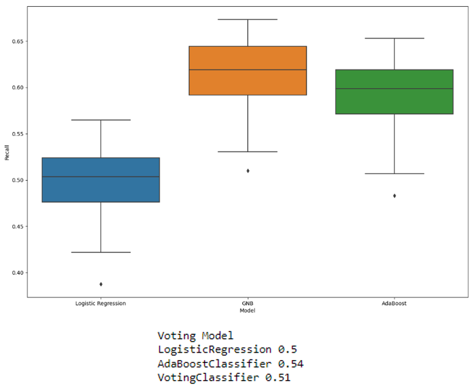
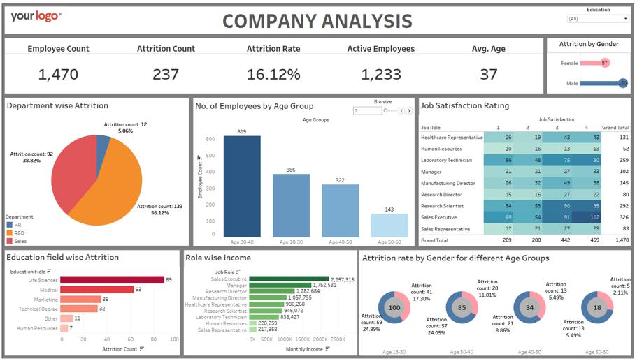
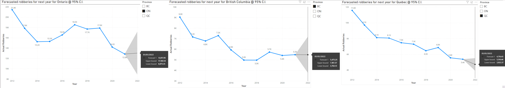
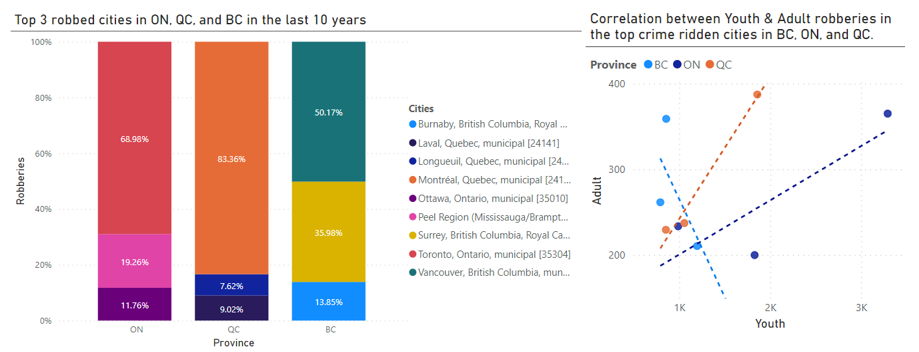
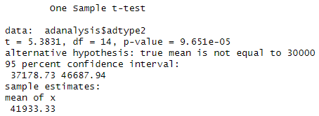
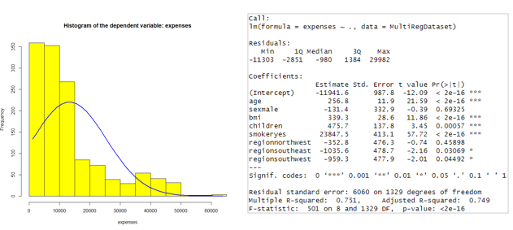
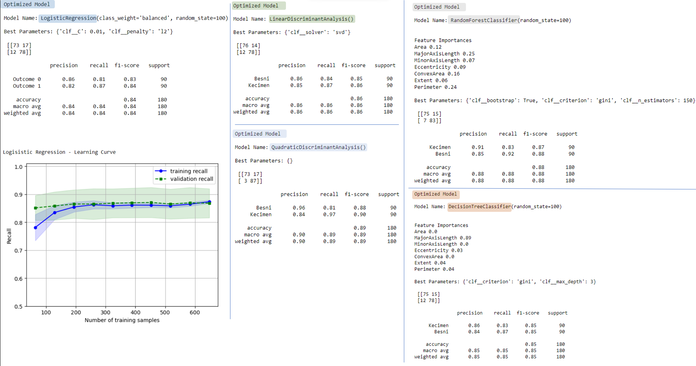
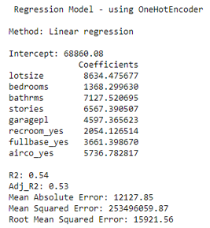

# Data Analyst
### with a background in engineering and business consulting

#### Technical Skills: Python, R, Advanced Excel, Tableau, Power BI, Hadoop, JIRA, VISIO, and MS Office

## Education
- Post Graduate, Data Analytics for Business Decision Making | Durham College, Canada (_2023_)								       		
- B. Eng. (Hons.), Electronics and Communications Engineering	| The University of Sheffield, U.K. (_2013_)	 			        		

## Work Experience (recent)
**Consultant @ Global Innovation & Technology Alliance (GITA) (_September 2019 - December 2022_)**
- Managed international industrial R&D funding programs, overseeing a 250,000 CAD budget while also conducting exploratory data analysis for 4500 Indian companies, cleaning and transforming data into actionable insights for the program design.
- Led a team, coordinated annual innovation events, and facilitated India-Europe technology transfer under Horizon 2020 call.

**Canadian Technology Accelerator Analyst @ The High Commission of Canada (_January 2022 - August 2022_)**
- Led Technology Accelerator program by selecting entities, conducting exploratory data analysis, and preprocessing industry data for program design.
- Translated data into insights through dashboards and reports, automated pipelines, and facilitated market connections, focusing on Waste to Wealth, Deep Tech, Clean Tech, and Digital industries.

## Projects

## Executive Conference Pitch (academic)
[Executive conference pitch to enhance tourism in India (2023) aided by analytics](https://youtu.be/i8wqwx-wp0I)

### Water potability analysis using Logistic Regression, Naïve Bayes, and Ada Boost models.

My client had requested assistance in predicting the potability of water and provided me with a dataset that contained 2007 records and 10 features. This was a case of classification and was conducted in **Python** by preparing the models by splitting the data into a training and testing set, using the Isolation Forest technique to remove outliers, scaling the data to avoid weighted presence of any features, plotting the learning curves to understand the biases and variances, model analysis of Logistic Regression, Naïve Bayes, and AdaBoost models against their recall, running the optimized Logistic regression and Naïve Bayes model, and finally creating the voting model using voting classifies, repeated k-fold, and cross-validation.
Based on my findings, I recommended the AdaBoost model based on the comparative results. It's important to note that the performance differences were relatively small, suggesting that all three models provide somewhat similar prediction capabilities on this dataset. AdaBoost model is known to be consistent, robust, and versatile and works well on various types of datasets  with fewer assumption requirements. Also, interpretations and explanations from this model are relatively easier.

Since none of the models performed particularly well, adding hyperparameter tuning and enhancing ensemble diversity would improve the model by improving its generalization capability.

### Tulip Executive Health Group Data Analysis
This report was intended to highlight insights for the Tulip Healthcare Group’s senior management team derived from the company’s 2021 data.
Tulip Healthcare Group employs 800-1200 individuals across Canada and partners with caregivers for a patient-centered service. With a mission to deliver a patient-oriented service, Tulip Healthcare Group provides in-person and virtual healthcare services across major provinces in Canada to company executives, athletes, and their family members. They offer services like annual health assessments, general testing, medical appointments, and therapy.

Tools used: **Tableau**
This report covered the following-
- Key Performance Questions
- A Dashboard geared towards the senior management
- Guidelines to optimally utilize the dashboard
- Design techniques used
- Recommendations

### Canadian Crime Analysis Report for The Royal Canadian Mounted Police
This analysis highlights the utilization of **Power BI** to create professional visualizations for crime analysis for the Royal Canadian Mounted Police (RCMP). This could help improve the collaboration and support with provincial police departments in Ontario, Quebec, and British Columbia.

*Insights*: Ontario showcased the highest crime rates, followed closely by Quebec and British Columbia. Cities such as Toronto, Montreal, and Vancouver consistently report the highest crime rates within their respective provinces. Additionally, a strong positive correlation in Quebec and Ontario was observed.

Forecasts conducted for the year ahead suggest a further decline in crime rates for Quebec, a moderate increase for Ontario, and a stable trend for British Columbia. The stability in crime rates should enable law enforcement agencies in British Columbia to focus on maintaining current crime prevention strategies and addressing specific localized issues.

### HR Data Analysis
I created a dynamic dashboard in **Tableau** for an HR department of a company which monitored several KPIs such as attrition, job satisfaction rating, role-wise income, and number of employees by age group.

Addressing the company's concern for in-depth insights, I concluded that in this company males attrite more, and the monthly salary and the job satisfaction rating were positively correlated. As the monthly salary increases, the job satisfaction increases. Job satisfaction ratings and department-wise attrition were not correlated, as falsely assumed.

### Advertising Analysis for Apple

Apple recently launched a new advertisement to boost sales of the new Apple product. At the moment, ad1 sells an average of 30,000 pieces per week. Apple has compiled the Ad2 sales information over the last 15 weeks and wanted to see if the average sales for Ad2 are 30,000 units and test the impact on sales from Ad2.
Using **R**, I conducted the t-Test and concluded that since the p-value 9.651 x 10-5 was lower than α i.e., 0.05, we have strong evidence to reject the null hypothesis that that the average mean sale was 30,000 units.

### Multi Regression Analysis on the effect of smoking on one’s expenses

To analyze the effect of smoking on one’s expenses I conducted an analysis using **R**. Starting off with a Histogram (to check the skewness, variance, and distribution of the expenses), I conducted a t-Test, and analyzed the data set using a simple linear regression model (to analyze the effect of smoking on expenses to check the establishment of a relationship, validity of the model, and predict), and a multiple linear regression model (to analyze the effect of all input variables on expenses).

Based on our performance measures, specifically the p-value, I concluded that since our p-value i.e., 2 x 10e-16 is smaller than the significance level 0.05, I reject the null hypothesis H_0 and conclude that there is a correlation between the variables. At least 1 of the independent variables (if not more) is correlated with the dependent output variable.

Model equation: Y(expenses) = -11942 + 257*age + b2*sex + 339*bmi + 476*no.ofchildren + b5*smokeryes + b6*region

The t-test revealed that at a 5% significance level, we have enough evidence that the mean expenses are not 10,000 units.
The simple linear regression model showed that at a 5% significance level, the model was not statically significant and there is indeed a relationship between the smoker variable and the output expense variable.
The multiple linear regression model showed that at a 5% significance level, the model IS statically significant and there is indeed a relationship between the input independent variables age, bmi, children, smokeryes, regionsoutheast, and regionsouthwest and the output expense variable.

### Rasin categorization using Optimized Decision Trees, Random Forests, Logistical Regression, and Discriminant Analysis (LDA and QDA).

I classified a categorization problem of segregating raisins using optimized Decision Trees, Random Forests, Logistic Regression, and Discriminant Analysis (LDA and QDA) using **Python**. Out of all, the Optimized QDA showed the best performance with an 89% accuracy, a higher precision of 96% for Besni in comparison to 84% for the Kecimen class. This is a measure of correctly predicting positive samples relative to the total samples predicted as positive.
The dataset had only 900 observations. Although difficult to monitor the collection of data, and expensive, a larger and normally distributed dataset would suffice the assumption for both LDA and QDA (better-performing models).

### House price prediction using multivariate regression modeling

My client was curious to know the housing price prediction in a neighborhood using a multiple regression model in **Python**. Unfortunately, the model was not feasible as the RMSE and MAE both were greater than 10% of the mean price i.e., 68,121.59. Regularization techniques such as Lasso or Ridge could possibly help improve the model's performance.

Using feature engineering, selecting appropriate features or a combination of features could result in an improved model. For example, exploring a combination of the basement & garage together as a variable could possibly give us further insights. Additionally collecting more data: This dataset only compromises of 546 observations. A larger dataset would be helpful in training the model and would also provide us with a bigger test set, which in return would give us a more accurate representation of the underlying patterns in the data.

### Additional projects -
- Linear regression analyzing stock returns using **R**
- Chi-squared analysis on a car-related database using **R**
- Graphical analysis on Detrimental effects of smoking using **Tableau**
- Possum regularization using optimized Lasso, Ridge, and Elastic Net models using **Python**
- Profit and loss analysis for a sample superstore using **Tableau**
- Predicting standardized scores post-training for students using **Python**
- Response model to enhance marketing campaigns using **Python**
- Predictive Modelling (regression models) for the weight of fish using **Python**
- Predictive Modelling for rice identification using Decision Trees using **Python**
- Infant Mortality Analysis using **Python**

- ETL using **Spark Streaming** and **Kafka**
- Analyzing New York City 311 Calls using **Spark Structured API**
